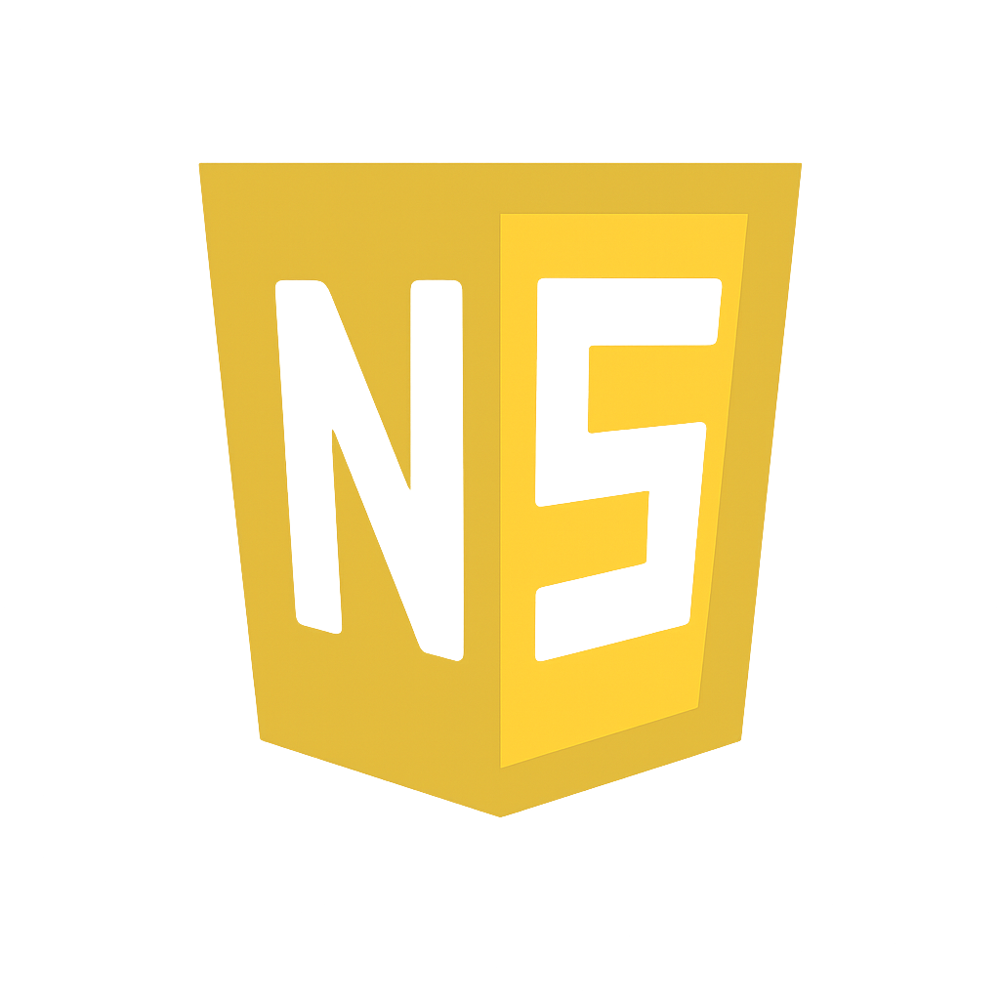

# Nextside — Comunidad de programación web

Nextside es una **comunidad para desarrolladores web**, donde tanto principiantes como expertos pueden aprender, compartir, crear y crecer juntos. Es un espacio abierto para hacer networking, resolver dudas, encontrar proyectos y generar vínculos dentro del mundo de la programación web.

---

## Contenido del proyecto

- **index.html**  
  Página principal con la estructura y contenido del sitio. Incluye secciones como:
  - Portada/Hero
  - Características de la comunidad
  - Invitación a Discord
  - Footer con recursos y fundadores

- **style.css**  
  Hoja de estilos personalizada con paleta dorada, animaciones suaves, diseño responsivo y estilos para cada sección.

- **next.png**  
  Logo principal de Nextside utilizado en la web.

---

## Características principales

- Diseño responsive y moderno (Bootstrap + CSS personalizado)  
- Portada animada y secciones interactivas  
- Paleta de colores en dorado y crema  
- Enlaces a recursos para frontend y backend  
- Invitación directa a la comunidad en Discord  
- Footer con enlaces a los perfiles de los fundadores  

---

## Vista previa

Puedes acceder a una demo en línea [aquí](https://nextside-es.vercel.app/) *(si está disponible)*.

---

## Instalación y uso local

1. Descarga o clona este repositorio.  
2. Asegúrate de que los archivos `index.html`, `style.css` y `next.png` se encuentren en la misma carpeta.  
3. Abre `index.html` en tu navegador.  

---

## Tecnologías utilizadas

- HTML5  
- CSS3 (custom + Bootstrap 5)  
- [Bootstrap 5 CDN](https://getbootstrap.com/)  
- [FontAwesome CDN](https://fontawesome.com/)  
- Google Fonts (Inter)  

---

## Créditos y fundadores

- [s1lenceSK1](https://github.com/s1lenceSK1)  
- [deltaccak](https://github.com/deltaccak)  

---

## Únete a la comunidad

Participa en un espacio colaborativo y lleva tu desarrollo al siguiente nivel.  
[Accede a nuestro Discord](https://discord.gg/W7jwy2NdQu)  

---

**Nextside — Comunidad de programación web. Juntos construimos el futuro del desarrollo.**
