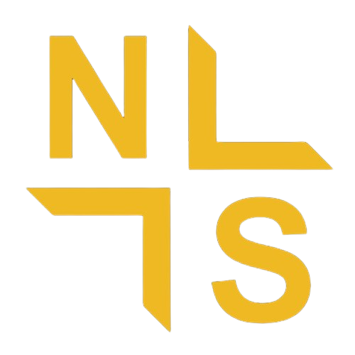

# Nextside — Comunidad de Programación

Nextside es una **comunidad para desarrolladores de todo tipo**, donde tanto principiantes como expertos pueden aprender, compartir, crear y crecer juntos. Es un espacio abierto para hacer networking, resolver dudas, encontrar proyectos y generar vínculos dentro del mundo de la programación.

---

## Características principales

- Diseño responsive y moderno (Bootstrap + CSS personalizado)  
- Portada animada y secciones interactivas  
- Paleta de colores en dorado y crema  
- Enlaces a recursos para frontend y backend  
- Invitación directa a la comunidad en Discord  
- Footer con enlaces a los perfiles de los fundadores
- Seccion de Nexyde Bot, con la informacion completa del bot, comandos, y mas.
- Seccion de Staff de Nexyde, con el Discord de cada uno, y sus GitHub

---

## Instalación y uso local

1. Descarga o clona este repositorio.  
2. Asegúrate de que todos los archivos esten en la misma carpeta.
3. Abre `index.html` en tu navegador.  

---

## Tecnologías utilizadas

- HTML5  
- CSS3 (custom + Bootstrap 5)
- JavaScript
- [Bootstrap 5 CDN](https://getbootstrap.com/)  
- [FontAwesome CDN](https://fontawesome.com/)  
- Google Fonts (Inter)  

---

## Fundadores

- [s1lenceSK1](https://github.com/s1lenceSK1)  
- [deltaccak](https://github.com/deltaccak)  

---

## Únete a la comunidad

Participa en un espacio colaborativo y lleva tu desarrollo al siguiente nivel.  
[Accede a nuestro Discord](https://discord.gg/W7jwy2NdQu)  

---

**Nextside — Comunidad de programación. Juntos construimos el futuro del desarrollo.**
